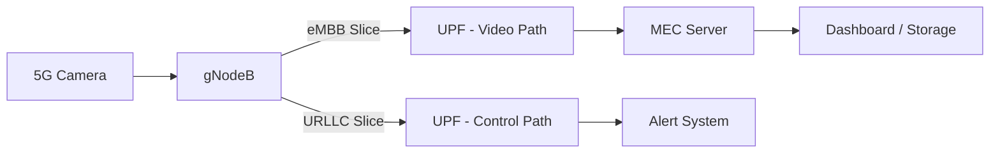

# Private 5G Enabled Intelligent Video Analytics System

## Overview

This project implements a real-time video analytics system built on a **private 5G network**. It integrates a SIM-enabled 5G camera with an edge-based machine learning pipeline to perform person detection, tracking, and counting.

The system is designed to address limitations of conventional Wi-Fi and cloud-based surveillance systems by leveraging key 5G capabilities such as **network slicing, edge computing (MEC), and local breakout via UPF**. This enables predictable latency, improved security, and full data locality.


---

## System Architecture

```mermaid
flowchart LR
    A[5G Camera (UE)] -->|Uplink Video (eMBB)| B[gNodeB]
    B --> C[UPF (Local Breakout)]
    C --> D[MEC Server]

    D --> E[Video Decode]
    E --> F[YOLO Detection]
    F --> G[Tracking]
    G --> H[Counting & Analytics]

    H -->|Alerts (URLLC)| I[Dashboard / Monitoring]
```

### Explanation

The camera operates as a 5G user equipment (UE) and continuously streams video over an uplink-optimized channel. The gNodeB forwards this data to the User Plane Function (UPF), which performs local breakout and routes the stream directly to the MEC server.

All processing is performed at the edge, avoiding cloud dependency. Detection, tracking, and counting are executed in sequence, and results are sent to monitoring systems. Latency-sensitive alerts are transmitted separately over a URLLC slice.

---

## 5G Network Design



### Explanation

The system uses network slicing to separate traffic based on requirements. Video streams are carried over the eMBB slice, while control and alert signals use a URLLC slice. This prevents congestion in video traffic from affecting time-critical analytics signals.

The UPF is deployed at the network edge, enabling local breakout. This ensures that all video data remains within the private network, reducing latency and improving security.

---

## Machine Learning Pipeline

```mermaid
flowchart LR
    A[RTSP Stream] --> B[Frame Decode]
    B --> C[Frame Buffer]

    C -->|Interval Detection| D[YOLO Model]
    D --> E[Bounding Boxes]

    E --> F[Centroid Tracker]
    F --> G[ID Assignment]

    G --> H[Counting Logic]
    H --> I[Output (Counts, FPS)]
```

### Explanation

The pipeline begins with RTSP stream ingestion and frame decoding. Frames are buffered to handle small variations in network timing. Detection is performed periodically rather than on every frame to improve efficiency.

Detected objects are passed to a centroid-based tracker that assigns persistent IDs across frames. This enables accurate counting of unique individuals and avoids duplicate counting. The final output includes bounding boxes, IDs, counts, and performance metrics.

---

## Key Features

* Real-time person detection using YOLO
* Multi-object tracking with persistent IDs
* Unique people counting (current and total)
* RTSP stream processing over 5G
* Low-latency edge inference using MEC
* Separation of video and control traffic using network slicing

---

## Implementation Details

* Video ingestion using OpenCV (RTSP)
* YOLO-based detection (Ultralytics)
* Custom centroid tracking algorithm
* Frame-skipping optimization for performance
* Real-time visualization with FPS monitoring

---

## Hardware Setup

* 5G SIM-enabled camera (acts as UE)
* Private 5G core (gNodeB, AMF, SMF, UPF)
* MEC server for running ML inference

---

## Results

The system demonstrates stable real-time performance with consistent detection and counting accuracy. By processing data at the edge, latency remains low and predictable compared to cloud-based systems.

---

## Comparison with Conventional Systems

| Feature       | Wi-Fi Systems      | Cloud-Based Systems | Proposed System          |
| ------------- | ------------------ | ------------------- | ------------------------ |
| Latency       | Variable           | High                | Low and predictable      |
| Security      | Limited            | External dependency | SIM-based authentication |
| Data Location | Local              | Cloud               | Fully local              |
| Reliability   | Interference-prone | Network dependent   | Controlled environment   |

---

## Applications

* Smart campus monitoring
* Industrial safety and surveillance
* Real-time occupancy tracking
* Edge AI and 5G research platforms

---

## Future Work

* Multi-camera integration
* Behavior analysis and anomaly detection
* Real-time alerting systems
* Adaptive QoS based on analytics feedback
* Hardware acceleration (GPU/FPGA)
