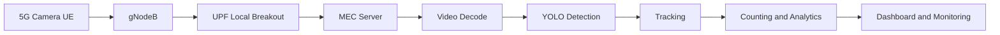
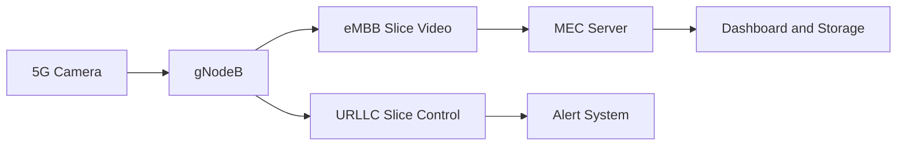

# Private 5G Enabled Intelligent Video Analytics System

## Overview

This project implements a real-time video analytics system built on a private 5G network. It integrates a SIM-enabled 5G camera with an edge-based machine learning pipeline to perform person detection, tracking, and counting.

The system leverages key 5G capabilities such as network slicing, edge computing (MEC), and local breakout via UPF to achieve low latency, improved security, and full data locality.

A detailed technical report is included in this repository.

---

## System Architecture

### Explanation

The camera operates as a 5G user equipment and streams video over the uplink. The gNodeB forwards this data to the UPF, which performs local breakout and sends the stream directly to the MEC server.

All processing is done at the edge. Detection, tracking, and counting are executed sequentially, and results are sent to monitoring systems.

---

## 5G Network Design

### Explanation

Video data is transmitted over the eMBB slice, while control and alert signals are transmitted over the URLLC slice. This separation ensures that critical signals are not delayed by high-volume video traffic.

The UPF is deployed at the edge, enabling local breakout and ensuring that all data remains within the private network.

---

## Machine Learning Pipeline

### Explanation

The pipeline begins with RTSP stream ingestion and frame decoding. Frames are buffered to handle variations in timing. Detection is performed periodically to improve efficiency.

Detected objects are tracked using a centroid-based tracker that assigns persistent IDs. This enables accurate counting of unique individuals and prevents duplicate counting.

---

## Key Features

* Real-time person detection using YOLO
* Multi-object tracking with persistent IDs
* Unique people counting
* RTSP stream processing over 5G
* Low-latency edge inference using MEC
* Separation of video and control traffic

---

## Implementation Details

* OpenCV for video ingestion
* Ultralytics YOLO for detection
* Custom centroid tracking algorithm
* Frame skipping for performance optimization
* Real-time FPS monitoring

---

## Hardware Setup

* 5G SIM-enabled camera
* Private 5G core with gNodeB and UPF
* MEC server for ML inference

---

## Results

The system achieves stable real-time performance with consistent detection and counting. Edge processing ensures low latency and predictable behavior.

---

## Comparison

| Feature     | WiFi Systems | Cloud Systems | This System |
| ----------- | ------------ | ------------- | ----------- |
| Latency     | Variable     | High          | Low         |
| Security    | Limited      | External      | SIM-based   |
| Data        | Local        | Cloud         | Fully Local |
| Reliability | Low          | Medium        | High        |

---

## Applications

* Smart campus monitoring
* Industrial safety
* Occupancy tracking
* Edge AI research

---

## Future Work

* Multi-camera system
* Behavior analysis
* Alert system
* Adaptive QoS
* Hardware acceleration

---

