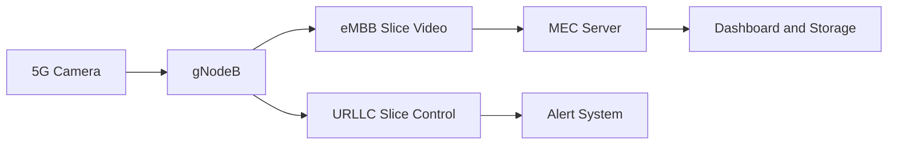

# Private 5G Enabled Intelligent Video Analytics System

## Overview

This project implements a real-time video analytics system built on a private 5G network. It integrates a SIM-enabled 5G camera with an edge-based machine learning pipeline to perform person detection, tracking, and counting.

The system leverages key 5G capabilities such as network slicing, edge computing (MEC), and local breakout via UPF to achieve low latency, improved security, and data locality.

A detailed technical report is not included due to institutional restrictions. This repository contains the implementation along with a summarized system description.

---

## System Architecture

### Explanation

The camera operates as a 5G user equipment and streams video over the uplink. The gNodeB forwards this data to the UPF, which performs local breakout and routes the stream directly to the MEC server.

All processing is performed at the edge. Detection, tracking, and counting are executed sequentially, and results are delivered to the monitoring system.

---

## 5G Network Design

### Explanation

Video data is transmitted over the eMBB slice, while control and alert signals are transmitted over the URLLC slice. This separation ensures that latency-sensitive operations are not affected by high-bandwidth video traffic.

The UPF is deployed at the network edge, enabling local breakout and ensuring that all data remains within the private network.

---

## Machine Learning Pipeline

### Explanation

The pipeline begins with RTSP stream ingestion and frame decoding. Frames are buffered to handle variations in timing. Detection is performed periodically to improve computational efficiency.

Detected objects are passed to a centroid-based tracking module that assigns persistent IDs across frames. This enables accurate counting of unique individuals and prevents duplicate counting.

---

## Technical Summary

* **Network Slicing:** eMBB slice for video transmission and URLLC slice for control signals
* **Edge Computing (MEC):** All inference is performed locally, reducing latency
* **Local Breakout (UPF):** Video data is processed within the private network without cloud dependency
* **Uplink Optimization:** Designed for continuous high-bitrate video transmission
* **Security:** SIM-based authentication provides stronger security than traditional IP camera systems

---

## Key Features

* Real-time person detection using YOLO
* Multi-object tracking with persistent IDs
* Unique people counting
* RTSP video processing over 5G
* Low-latency edge inference
* Separation of video and control traffic

---

## Implementation Details

* OpenCV for RTSP video ingestion
* Ultralytics YOLO for detection
* Custom centroid tracking algorithm
* Frame skipping for performance optimization
* Real-time FPS monitoring

---

## Hardware Setup

* 5G SIM-enabled camera
* Private 5G core with gNodeB and UPF
* MEC server for ML inference

---

## Results

The system achieves stable real-time performance with consistent detection and counting accuracy. Processing at the edge ensures low latency and predictable behavior compared to cloud-based approaches.

---

## Comparison

| Feature     | WiFi Systems | Cloud Systems | Proposed System |
| ----------- | ------------ | ------------- | --------------- |
| Latency     | Variable     | High          | Low             |
| Security    | Limited      | External      | SIM-based       |
| Data        | Local        | Cloud         | Fully Local     |
| Reliability | Low          | Medium        | High            |

---

## Applications

* Smart campus monitoring
* Industrial safety
* Occupancy tracking
* Edge AI research

---

## Future Work

* Multi-camera integration
* Behavior analysis and anomaly detection
* Real-time alert systems
* Adaptive QoS
* Hardware acceleration

---

##
